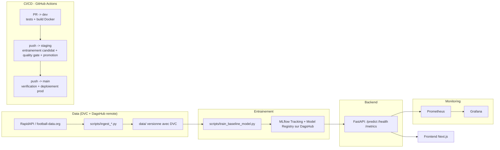

# World Cup Predictor 2026

Projet MLOps autour de la Coupe du Monde 2026 : une API qui prédit le résultat
d'un match de football entre deux équipes (victoire domicile / nul / victoire
extérieur), avec le cycle de vie MLOps complet (versioning des données,
tracking et registre de modèles, CI/CD avec quality gates, déploiements
reproductibles, monitoring).

## Déploiements en ligne

| Environnement | URL |
|---|---|
| Frontend - production | https://fifa-frontend-7be5.onrender.com |
| API - staging | https://fifa-world-cup-analysis-phep.onrender.com |
| API - production | https://fifa-backend-production.onrender.com |
| Monitoring - Prometheus | https://fifa-prometheus.onrender.com |
| Monitoring - Grafana | https://fifa-graphana.onrender.com |

Exemple d'appel à l'API de production :

```bash
curl -X POST https://fifa-backend-production.onrender.com/predict \
  -H "Content-Type: application/json" \
  -d '{"home_team": "France", "away_team": "Argentina", "stage": "GROUP_STAGE"}'
```

## Endpoints de l'API

| Endpoint | Description |
|---|---|
| `POST /predict` | Prédit le résultat d'un match (`home_team`, `away_team`, `stage`) |
| `GET /matches` | Matchs de la Coupe du Monde en cours (statut, score, groupe, phase) — proxy en cache de football-data.org |
| `GET /standings` | Classements par groupe |
| `GET /tournament` | Simulation du bracket à élimination directe et du vainqueur final probable |
| `GET /health` | État du service |
| `GET /metrics` | Métriques Prometheus |

Le frontend (`frontend/`) consomme ces endpoints pour afficher un dashboard en
direct découpé en plusieurs pages : accueil, matchs, classements, simulation du
tournoi et prédicteur libre. Les données live sont rafraîchies automatiquement
toutes les 60 secondes sur les pages concernées.

Routes principales du frontend :

| Route | Usage |
|---|---|
| `/` | Accueil et navigation |
| `/matches` | Prochains matchs, résultats et prédictions par match |
| `/standings` | Classements par groupe |
| `/tournament` | Simulation du tournoi et champion probable |
| `/predict` | Simulateur libre entre deux équipes |

## Architecture



## Stack

- **Backend** : FastAPI, servi par Uvicorn, packagé en Docker
- **Frontend** : Next.js
- **Data versioning** : DVC, remote DagsHub
- **Model tracking & registry** : MLflow (serveur hébergé par DagsHub)
- **Monitoring** : Prometheus + Grafana
- **Déploiement** : Render (Docker, un service par environnement)
- **CI/CD** : GitHub Actions

## Stratégie Git

```text
feature/* -> dev -> staging -> main
```

- `feature/*` : développement individuel
- `dev` : intégration de l'équipe
- `staging` : validation pré-production
- `main` : production

Personne ne travaille directement sur `dev`, `staging` ou `main` : tout passe
par une Pull Request.

## Pipelines CI/CD

Trois workflows GitHub Actions, un par transition de branche :

### 1. `PR -> dev` ([.github/workflows/pr-dev.yml](.github/workflows/pr-dev.yml))
Déclenché sur toute Pull Request vers `dev`. Étapes : installation des
dépendances, tests unitaires + intégration + end-to-end (`pytest`), build de
l'image Docker du backend (sans la publier).

### 2. `dev -> staging` ([.github/workflows/dev-to-staging.yml](.github/workflows/dev-to-staging.yml))
Déclenché sur push vers `staging` (fusion d'une PR validée). C'est le
**pipeline de promotion de modèle** :
1. Suite de tests complète
2. `dvc pull` pour récupérer la dernière version des données
3. Entraînement d'un modèle candidat (`scripts/train_baseline_model.py`),
   enregistré dans le MLflow Model Registry avec ses métriques, le hash du
   commit Git et la version DVC des données utilisées
4. `scripts/promote_model.py` : le candidat est passé au stage `Staging`,
   puis promu au stage `Production` si son accuracy dépasse le seuil de
   qualité (`QUALITY_GATE_MIN_ACCURACY`, 0.5 par défaut) — sinon il reste en
   `Staging` et la production n'est pas modifiée
5. Déclenchement du redéploiement du service Render de staging

### 3. `staging -> main` ([.github/workflows/staging-to-main.yml](.github/workflows/staging-to-main.yml))
Déclenché sur push vers `main`. Vérifie qu'une version du modèle est bien au
stage `Production` (`scripts/verify_production_model.py` — si aucune version
n'a passé le gate, le déploiement est bloqué), relance la suite de tests, puis
déclenche le redéploiement du service Render de production.

## Modèle de promotion

Le [MLflow Model Registry](https://dagshub.com/Adrienqry/Fifa-World-Cup-analysis)
hébergé sur DagsHub est la **source de vérité** pour les déploiements : le
backend charge toujours son modèle depuis le registre (`models:/fifa-world-cup-baseline/<stage>`),
jamais depuis un fichier local. Le stage chargé est configurable via la
variable d'environnement `MODEL_STAGE` (`Staging` sur l'environnement de
staging, `Production` sur l'environnement de production).

Chaque version enregistrée trace :
- ses métriques (accuracy)
- ses paramètres (type de modèle, colonnes de features)
- la version des données DVC utilisée pour l'entraîner
- le hash du commit Git correspondant

## Monitoring

Le backend de production expose `/metrics` au format Prometheus :
`prediction_requests_total`, `prediction_failures_total`,
`prediction_latency_seconds`, `backend_healthy`, `backend_uptime_seconds`.

- **Prometheus** (https://fifa-prometheus.onrender.com) scrape cette route
  toutes les 30 secondes (config : [monitoring/prometheus/prometheus.yml](monitoring/prometheus/prometheus.yml))
- **Grafana** (https://fifa-graphana.onrender.com) affiche le dashboard
  "FIFA World Cup Backend" (provisionné automatiquement, voir
  [monitoring/grafana/provisioning](monitoring/grafana/provisioning)) : volume
  de requêtes, latence des prédictions, taux d'erreur, statut de santé.
  Connexion : utilisateur `admin`, mot de passe défini via la variable
  d'environnement `GF_SECURITY_ADMIN_PASSWORD` du service Render.

## Reproductibilité / installation locale

```bash
python -m venv .venv
source .venv/bin/activate  # ou .venv\Scripts\activate sous Windows
pip install -r requirements.txt
cp .env.example .env  # puis remplir les valeurs (voir ci-dessous)
```

Variables d'environnement nécessaires dans `.env` :

| Variable | Usage |
|---|---|
| `WORLD_FOOTBALL_RANKING_API_KEY` | clé RapidAPI pour récupérer le classement FIFA |
| `FOOTBALL_DATA_API_KEY` | clé football-data.org pour les matchs/classements en direct (`/matches`, `/standings`, `/tournament`) |
| `MLFLOW_TRACKING_URI` | serveur MLflow DagsHub |
| `MLFLOW_TRACKING_USERNAME` / `MLFLOW_TRACKING_PASSWORD` | identifiants DagsHub |
| `DAGSHUB_USERNAME` / `DAGSHUB_TOKEN` | identifiants pour `dvc pull` |

Récupérer les données versionnées avec DVC :

```bash
dvc pull
```

Lancer les tests :

```bash
pytest
```

Lancer le backend en local :

```bash
uvicorn backend.main:app --reload
```

Lancer avec Docker (le conteneur fait son propre `dvc pull` au démarrage s'il
trouve `DAGSHUB_USERNAME`/`DAGSHUB_TOKEN` dans l'environnement) :

```bash
docker build -t fifa-backend .
docker run -p 8000:8000 --env-file .env fifa-backend
```

### Régénérer le pipeline de données depuis zéro

```bash
python scripts/ingest_data.py                 # data/raw/worldcup_matches.json
python scripts/preprocess_matches.py          # data/processed/matches_processed.csv
python scripts/ingest_fifa_rankings.py        # data/raw/fifa_ranking_current.json
python scripts/preprocess_fifa_rankings.py    # data/processed/fifa_rankings_current.csv
python scripts/build_training_dataset.py      # data/processed/training_matches.csv
python scripts/train_baseline_model.py        # entraine + logge sur MLflow
```

## Répartition initiale de l'équipe

- **Data / ML** : données, features, modèle, DVC, MLflow
- **Backend / API** : FastAPI, endpoints, connexion au modèle
- **Frontend / DevOps** : interface Next.js, Docker, CI/CD, Render, monitoring

Voir [docs/team-tasks.md](docs/team-tasks.md) et [SUIVI_PROJET.md](SUIVI_PROJET.md)
pour le détail de l'avancement.
